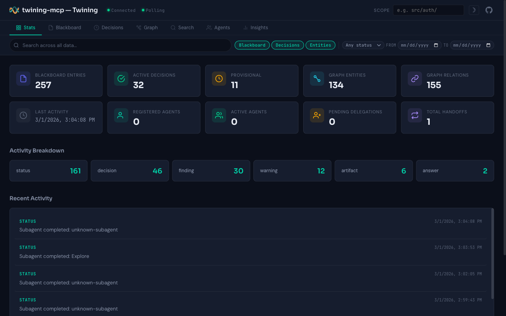
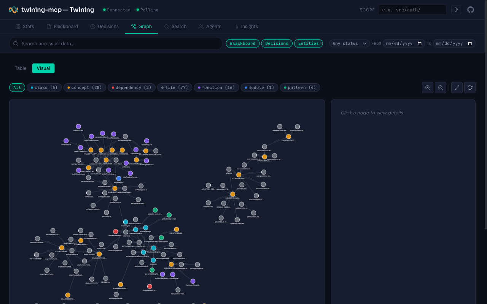

<p align="center">
  
</p>

<p align="center">
  <strong>Your AI agents forget everything. Twining remembers.</strong><br>
  Persistent project memory for Claude Code and other MCP clients.
</p>

<p align="center">
  <a href="https://www.npmjs.com/package/twining-mcp"></a>
  <a href="https://github.com/daveangulo/twining-mcp/actions/workflows/ci.yml"></a>
  <a href="LICENSE"></a>
</p>

---

## The Problem

You spend two hours with Claude Code making architectural decisions. You choose PostgreSQL over MongoDB. You settle on JWT for auth. You flag a race condition in the payment module. Then the session ends.

Tomorrow you start a new session. Claude has no idea what happened. The decisions are gone. The warnings are gone. The rationale is gone. You re-explain everything — or worse, Claude silently contradicts yesterday's choices.

This gets worse with multiple agents. Agent A decides on REST. Agent B picks gRPC for the same service. Neither knows the other exists. You find out when the code doesn't compile.

**Context windows are ephemeral. Your project's decisions shouldn't be.**

## How Twining Fixes It

Twining is an MCP server that gives your AI agents persistent project memory. Decisions survive context resets. New sessions start informed. Multi-agent work stays coordinated.

```
# Install in 10 seconds
/plugin marketplace add daveangulo/twining-mcp
/plugin install twining@twining-marketplace
```

**Record what you did — in natural language:**
```
twining_record({
  summary: "Added Redis caching to UserService",
  decisions: ["Chose Redis over Memcached — need persistence across restarts"],
  assumptions: ["Read-heavy workload (10:1 ratio)"],
  scope: "src/services/"
})
```
Twining parses your decisions into structured records — extracting rationale, rejected alternatives, and domain automatically. One tool call, no forms.

**Start a new session. Get caught up instantly:**
```
twining_assemble({ task: "optimize the caching layer", scope: "src/services/" })
```
Twining scores every decision, warning, and finding by relevance to your task, then fills a token budget in priority order. You get exactly the context you need — no firehose, no re-explaining.

**Ask why things are the way they are:**
```
twining_why({ scope: "src/auth/middleware.ts" })
```
Returns the full decision chain for any file: what was decided, when, why, what alternatives were rejected, and which commit implemented it.

## Why Not Just Use CLAUDE.md?

CLAUDE.md is static. You write it once and update it manually. It doesn't capture decisions *as they happen*, doesn't track rationale or alternatives, doesn't detect conflicts between agents, and can't selectively assemble context within a token budget.

Twining is dynamic. Every `twining_record` call captures decisions with their rationale and rejected alternatives. Every `twining_post` shares a finding or warning. Every `twining_assemble` scores relevance and delivers precisely what the current task needs. The `.twining/` directory is your project's living institutional memory.

The two are complementary, not rivals: CLAUDE.md is the right home for standing instructions ("always run the linter"), Twining for the accumulating record of what was decided and why.

## Why Not an Orchestrator?

Orchestrators (like agent swarms and hierarchical coordinators) route work by *assigning tasks*. Twining coordinates by *sharing state*. The difference matters:

- **Orchestrators** hold coordination context in their own context window — a single point of failure that degrades as the window fills
- **Twining's blackboard** persists coordination state outside any agent's window, surviving context resets without information loss

Agents self-select into work by reading the blackboard. No central bottleneck. No relay that drops context. Every agent sees every other agent's decisions and warnings, directly.

## Install

### Plugin Install (Recommended)

```bash
# Add the marketplace (one-time)
/plugin marketplace add daveangulo/twining-mcp

# Install the plugin
/plugin install twining@twining-marketplace
```

Includes the MCP server, skills, lifecycle hooks, and pre-commit enforcement. Two gates: `twining_assemble` before working, `twining_record` before committing.

To be precise about what "enforced" means, since it differs per gate: **Gate 2 is hook-enforced** — a pre-commit hook blocks `git commit` until this session has recorded, and a Stop hook asks for a record before the session ends. **Gate 1 is instruction-only** — it is injected into the session by the SessionStart hook and the MCP server's instructions, and nothing blocks an agent that skips it. In practice compliance is high (a field project measured 90.7% of decisions recorded after an assemble), but it is a convention the agent follows, not a wall.

### Team Auto-Install

Commit this to your repo's `.claude/settings.json` so every team member gets Twining on clone:

```json
{
  "extraKnownMarketplaces": {
    "twining-marketplace": {
      "source": {
        "source": "github",
        "repo": "daveangulo/twining-mcp"
      }
    }
  },
  "enabledPlugins": {
    "twining@twining-marketplace": true
  }
}
```

When team members trust the repository folder, Claude Code automatically installs the marketplace and plugin.

> **v2 is stable:** v2.0.0 (sqlite-by-default, Node >= 22.13) ships on the default npm channel — plain `npx -y twining-mcp` gets it. Existing v1 projects keep working unchanged; the sqlite migration is opt-in via `npx twining-mcp migrate`. See [docs/UPGRADE-v2.md](docs/UPGRADE-v2.md).

### MCP-Only Install

For non-Claude-Code clients (Cursor, Windsurf, etc.):

```bash
claude mcp add twining -- npx -y twining-mcp --project .
```

Or add to `.mcp.json`:

```json
{
  "mcpServers": {
    "twining": {
      "command": "npx",
      "args": ["-y", "twining-mcp", "--project", "."]
    }
  }
}
```

MCP server instructions are included automatically in the initialize response.

### Troubleshooting: the twining tools aren't there

Twining fails quiet — when the server can't start, no error surfaces in the session and the tools simply never appear. Work through this in order:

1. **Ask an agent what it can actually see.** Have it run `ToolSearch` for `twining` and report the raw result, or run `/mcp`. Do not infer from behavior; agents will substitute plausible-looking alternatives rather than report a missing tool.
2. **If `ToolSearch` finds nothing, the server isn't running.** Probe the launcher directly:
   ```bash
   bash "$CLAUDE_PLUGIN_ROOT/scripts/launch-server.sh" --probe   # → runner=<rung> node=<version>
   ```
   `runner=none` means every resolution rung failed — see the next section.

   **A healthy `runner=` does not mean the server can start.** The probe checks that `npx` *runs*, not that it can *fetch* the package. A registry policy (npm's `minimumReleaseAge`, common in corporate setups), an auth or proxy failure, or simply being offline all produce `runner=npx` and then a dead launch. Since plugin 1.24.0 the launcher detects that and falls back to the bundled server automatically; on older plugins it exits with npx's error, which appears in the MCP log below.
3. **Check the MCP log** for the real error: `~/Library/Caches/claude-cli-nodejs/<project>/mcp-logs-twining/` on macOS.
4. **Check that the plugin is enabled in *this* configuration.** `/plugin` shows what the current session loaded. A different `CLAUDE_CONFIG_DIR`, or a worktree without the project-scope settings, can load no plugin at all — no MCP, no hooks, no skills.
5. **If tools exist in your main session but not in a spawned agent**, see [Agent teams and subagents](#agent-teams-and-subagents) below.

While the server is down, the commit gate still applies in an initialized checkout. Bypass with `TWINING_DISABLED=true git commit ...` and note key decisions in your summary so a connected session can record them.

### PATH-restricted environments (agent teams, GUI launches)

When Claude Code is spawned with a minimal environment — agent-team teammates (e.g. cmux split panes), GUI-launched apps, some CI shells — the directory holding `npx` (Homebrew, nvm, etc.) may not be on `PATH`. The stdio server then fails to spawn and twining's tools are **silently absent**: no error surfaces in the session, the tools just never appear. Confirm by checking the MCP log (`~/Library/Caches/claude-cli-nodejs/<project>/mcp-logs-twining/` on macOS) for:

```
Connection failed: Executable not found in $PATH: "npx"
```

Fix (macOS/Linux): wrap the server command in a login shell so `PATH` is rebuilt from the login profile (`path_helper` on macOS):

```json
{
  "mcpServers": {
    "twining": {
      "command": "sh",
      "args": ["-lc", "exec npx -y twining-mcp --project ."]
    }
  }
}
```

**The plugin's bundled server does this automatically since plugin 1.13.0** — it spawns through `sh -c` and recovers a usable `PATH` inside `scripts/launch-server.sh`, so plugin users need no per-project fix. The manual snippet above is only for standalone `.mcp.json` installs. If even a login shell can't find `npx`, the plugin's SessionStart hook detects it and injects a warning into the session instead of failing silently — and since plugin 1.18.0 the launch itself falls back through a ladder of alternatives first (next subsection).

**Windows:** the bundled server's `sh` launcher does not resolve there. Windows sessions inherit the registry `PATH` and never had the minimal-PATH problem, so the fallback is a one-line project `.mcp.json` with the bare command instead: `"command": "npx", "args": ["-y", "twining-mcp@^2.0.0", "--project", "."]` (the plugin's hooks, skills, and gates are unaffected).

#### Node installed but npm/npx missing

A login shell only fixes *off-PATH* `npx` — some environments have `node` with no npm/npx at all. Common cases: Debian/Ubuntu's `nodejs` apt package (npm is a separate package there), Alpine's `nodejs` apk (same), Amazon Linux 2023 when the `nodejs-npm` subpackage isn't installed, nix's `nodejs-slim` (deliberately npm-free), and version-manager shims (nvm/asdf/volta) left pointing at a removed install.

**Since plugin 1.19.0, node-only environments work fully — offline included.** The bundled server launches through `plugin/scripts/launch-server.sh`, which walks a resolution ladder and execs the first rung that works:

1. **`TWINING_SERVER_JS` override** — set it to any server entry point and the script runs `node "$TWINING_SERVER_JS"` directly. Beats every other rung; intended for development builds and unusual layouts.
2. **Project pin** — `./node_modules/twining-mcp/dist/index.js` (relative to the project root), if the project has `twining-mcp` installed locally (`npm i -D twining-mcp`). A project pin outranks the npm rungs *and* the plugin's bundled copy, so a project can hold its server version independent of plugin updates.
3. `npx` from the recovered `PATH` — the normal case. Since 1.24.1 recovery *merges* the login-shell `PATH` ahead of the inherited one (a `~/.profile` that assigns `PATH` without a `$PATH` passthrough can no longer clobber a workable inherited `PATH`), and if `node` is still unresolvable it appends well-known install dirs that exist (`~/.local/bin`, `/opt/homebrew/bin`, `/usr/local/bin`, volta/asdf/mise shims) — covering dirs that only interactive rc files add;
4. npm's `npx-cli.js` resolved relative to the `node` binary itself (`<node bin>/../lib/node_modules/npm/bin/npx-cli.js`) — this self-heals broken version-manager shims and installs where npm exists but isn't on `PATH`;
5. a globally installed `twining-mcp`, if present;
6. **the plugin-bundled server** — a dependency-free single-file bundle shipped with the plugin, run directly with `node` (requires Node >= 22). No npm, no npx, no network: a bare distro Node is enough for a fully working server, offline included. On this rung semantic search degrades to keyword mode, announced with a one-line stderr notice.

Only when every rung fails — no Node at all, or Node too old for the bundle — does the script exit 127 with guidance on stderr, and the plugin's SessionStart hook (which probes the same script via `--probe`) injects an explicit warning into the session. In that state the commit gate still applies in initialized checkouts (a `.twining/` directory exists but no server is reachable); bypass a blocked commit in the interim with:

```bash
TWINING_DISABLED=true git commit ...
```

**Full semantic search still needs the real npm package** (the bundle ships without the embedding dependency). On a distro Node without npm, install npm alongside it:

- Debian/Ubuntu: `sudo apt install npm`
- Alpine: `apk add npm`
- Amazon Linux 2023: `sudo dnf install nodejs-npm` (versioned streams use e.g. `nodejs22-npm`)
- or reinstall Node from [nodejs.org](https://nodejs.org), which bundles npm

Once npm is present the ladder resolves the full package via `npx` automatically; running `npm i -D twining-mcp` in the project additionally pins it (rung 2) so the server version is under project control.

Manual MCP-only installs (the `.mcp.json` snippets above) are unaffected — they point at `npx` directly, as before.

### Upgrading from Manual Install

If you previously configured Twining manually, switch to the plugin:

1. Remove manual MCP server: `claude mcp remove twining`
2. Install plugin: `/plugin marketplace add daveangulo/twining-mcp` then `/plugin install twining@twining-marketplace`
3. Clean up: remove Twining hooks from `.claude/settings.json`, remove `.claude/agents/twining-aware.md` if present, remove Twining sections from `CLAUDE.md` (skills handle this now)
4. Keep: `.twining/` directory (all state preserved)
5. Verify: `/twining:status`

### Get the Most Out of It

The plugin handles agent instructions automatically via skills. For the MCP-only install path, add Twining instructions to your project's `CLAUDE.md` so agents use it automatically — see **[docs/CLAUDE_TEMPLATE.md](docs/CLAUDE_TEMPLATE.md)** for a ready-to-copy template.

### Shared Store Across Repos

By default the server uses the project it starts in. To point several sibling repos at **one** coordination store (so cross-repo agents see each other's decisions and blackboard), set `TWINING_PROJECT` in each repo's `.claude/settings.json`:

```json
{ "env": { "TWINING_PROJECT": "/path/to/shared-chassis" } }
```

Resolution order: `--project <arg>` > `$TWINING_PROJECT` > cwd. Relative values resolve against the server's working directory (the repo root); absolute paths are recommended for multi-machine setups. This replaces the old pattern of a per-repo `.mcp.json` override plus an exact-command `deniedMcpServers` block, which silently broke on every plugin version bump.

### Git Worktrees & Agent Teams

When the project root is a **linked git worktree** (its `.git` is a `gitdir:` file pointing into the main checkout's `.git/worktrees/`), Twining resolves to the **main checkout's** `.twining` by default. Agent teammates spawned into worktrees (e.g. `claude-teams --worktree`) previously forked the store — their decisions and records landed in a worktree-local `.twining` the main session never saw. Now all worktrees of a repo share one store, with the same gate semantics as multiple sessions working in one directory.

Two overrides:

- `--project` / `TWINING_PROJECT` always win — an explicit project is never redirected.
- `TWINING_WORKTREE_LOCAL=true` opts out, keeping a worktree-local store.

The plugin's hooks apply the same resolution (and honor `TWINING_PROJECT`). Submodules are not affected — their `gitdir:` files point at `.git/modules/`, not `.git/worktrees/`.

### Agent teams and subagents

Spawned agents do not automatically inherit Twining's tools, and when they don't, they fail quietly — an agent with no `twining_*` tools will often improvise (reading `.twining/` with `sqlite3` or `jq`) rather than report the gap. Two independent things have to hold.

**1. The server has to be running for that session.** Teammates launched in separate panes or processes get their own MCP connection. If the launcher can't resolve a runtime there, *no* agent in that session gets Twining tools, generic or otherwise. Diagnose with the [troubleshooting steps](#troubleshooting-the-twining-tools-arent-there) above — this is the more common cause by far.

**2. The agent definition must not restrict its tools.** MCP tool names are namespaced at runtime by the server they came from: `mcp__plugin_twining_twining__twining_assemble` under a plugin install, `mcp__twining__twining_assemble` under a standalone `.mcp.json`. A custom agent whose frontmatter declares a `tools:` allowlist gets **only** what it lists, and entries that match nothing are dropped silently — so a bare `twining_assemble` in an allowlist yields no tool and no warning. Because the correct prefix depends on how Twining was installed, hardcoding one breaks the other install mode.

The reliable pattern is to **omit `tools:` entirely** so the agent inherits whatever the session exposes, and to have the agent locate the tools with `ToolSearch` rather than assuming a name. If you must restrict tools, include `ToolSearch` so the agent can still discover what it has.

When you dispatch agents, tell them explicitly: *report it if the Twining tools are absent, rather than working around it.* A silent substitution produces work that looks coordinated and isn't.

**Where to set `TWINING_PROJECT`:** in an environment both the hooks *and* the MCP server actually see — an exported terminal/session environment (a launcher wrapper, direnv, the shell you start Claude Code or cmux from). Avoid the two tempting-but-wrong places: `.claude/settings.json` `env` is currently **not delivered to plugin-spawned MCP servers** (hooks would redirect while the server doesn't — the gates then check a store the server never writes), and a machine-wide shell-profile export activates the commit/stop gates in **every** repo on the machine, including ones that never used Twining.

### Dashboard

A web dashboard starts automatically at `http://localhost:24282` — browse decisions, blackboard entries, knowledge graph, and agent state. Configurable via `TWINING_DASHBOARD_PORT`.

Built to stay usable at scale: lists are virtualized with live facet counts, the decisions timeline is a zoomable density histogram that switches to individual items as you zoom in, and the knowledge graph opens as a readable type-level overview you drill into (never a hairball). Every view respects the scope breadcrumb, and the URL captures tab/filters/selection for shareable deep links.

<p align="center">
  <br>
  <em>Stats overview: blackboard entries, decisions, graph entities, and activity breakdown</em>
</p>

<p align="center">
  <br>
  <em>Interactive knowledge graph: files, decisions, classes, and their relationships</em>
</p>

## What's Inside

### Core Tools (always available)

The full default surface is these 13 tools. Everything else needs `full_surface: true` — if a tool is not on this list, assume you cannot call it until you have opted in.

| Tool | What It Does |
|------|-------------|
| `twining_assemble` | **Gate 1:** Build tailored context for a task — decisions, warnings, handoffs, within a token budget |
| `twining_record` | **Gate 2:** Record what you did and any choices made — natural language in, structured decisions out |
| `twining_post` | Share findings, warnings, needs, or status during work. `summary` is capped at 200 characters and longer summaries are **rejected** — put the substance in `detail` |
| `twining_why` | Check what decisions constrain a file before modifying it |
| `twining_status` | Health check — entry counts, decision counts, actionable warnings |
| `twining_housekeeping` | Periodic maintenance — archive, deduplicate, surface stale decisions (dry-run by default). Optional `staleness_review`, `merge_sweep`, and `compact_archives` flags |
| `twining_archive` | Move blackboard entries to the archive tier. **Takes no cutoff by default — an argument-free call archives everything archivable**, so pass `before` unless you intend a full sweep |
| `twining_archive_stale` | Archive caller-confirmed candidate IDs from staleness or merge-sweep review. Decisions move to `archived` status; entries are dismissed. Provenance preserved |
| `twining_add_entity` | Add a knowledge-graph entity |
| `twining_add_relation` | Add a knowledge-graph relation |
| `twining_neighbors` | Traverse the graph from an entity |
| `twining_graph_query` | Query graph entities and relations |
| `twining_prune_graph` | Remove stale graph nodes |

`twining_record` accepts natural language decisions like `"Chose Redis over Memcached — need persistence"` and automatically parses them into structured records with rationale, rejected alternatives, and inferred domain. It also accepts assumptions, constraints, affected files, and dependency chains — everything the decision store needs for high-fidelity context assembly.

### Extended Tools (available with `full_surface: true`)

For advanced workflows — deep decision management, graph exploration, multi-agent coordination:

| Category | Tools |
|----------|-------|
| **Decisions** | `twining_decide`, `twining_search_decisions`, `twining_reconsider`, `twining_link_commit`, `twining_trace`, `twining_override`, `twining_promote`, `twining_commits` |
| **Blackboard** | `twining_read`, `twining_query`, `twining_recent`, `twining_dismiss` |
| **Context** | `twining_summarize`, `twining_what_changed` |
| **Triage** | `twining_triage` |
| **Coordination** | `twining_register`, `twining_agents`, `twining_discover`, `twining_delegate`, `twining_handoff`†, `twining_acknowledge`† |
| **Lifecycle** | `twining_verify`, `twining_export` |

† Deprecated in v2.0 — real handoffs happen as git-committed markdown docs; redesign or v3 removal tracked in [#33](https://github.com/daveangulo/twining-mcp/issues/33).

**You do not need `twining_decide`.** It is the most commonly reached-for extended tool, but `twining_record`'s `decisions` array writes to the same decision store and is available by default. `twining_record` also accepts `commit_hash`, `supersedes`, and `depends_on`, covering what `twining_link_commit` and `twining_override` do for the common cases. Reach for the extended surface when you need decision *archaeology* (`trace`, `search_decisions`) or the provisional ratification lifecycle — not for ordinary recording.

Enable with `.twining/config.yml`:
```yaml
tools:
  full_surface: true
```

### Using It Well

Guidance from measuring real projects, including one with 2,300+ decisions. These are the things that most affect how much value you get back.

**Decisions are permanent; the blackboard is working memory.** Decisions are never archived by age and are always retrievable. Findings, statuses, and answers live on the blackboard, which archives on a rolling horizon once it grows past a threshold — in a busy project that horizon is days, not months. If a piece of knowledge should still matter next month, it belongs in a `twining_record` decision, not a `twining_post` finding. Post findings freely for in-flight signal; do not use them as long-term storage.

**Pass `commit_hash` when you record.** Without it, nothing connects a decision to the code that implements it, and `twining_why` cannot tell you which commit acted on a decision. Measured commit-to-decision linkage in the field: 12%. Recording after you commit, with the hash, is the cheapest fix.

**Pass `agent_id` if you run more than one agent.** It defaults to `main`, and in a field project 91% of decisions collapsed to that default even though 39 distinct agent names were in use. Per-agent attribution, liveness, and coordination views are only as good as this field.

**Use the narrowest scope that fits.** `src/auth/` retrieves far better than `project`. Scope drives both what an agent sees on assemble and how `twining_why` ranks results.

**Write the actual reason.** A rationale that restates the summary records the WHAT and loses the WHY, which is the whole point. `twining_record` will accept it either way — the store cannot tell the difference, so this one is on you.

## How It Works

All state lives in `.twining/` as plain, committable files. Everything is `jq`-queryable, `grep`-able, and git-diffable. No cloud. No accounts. Since v2, new projects default to the local SQLite backend — the database itself is a gitignored derived cache; the committed truth is a per-record JSON export tree (`.twining/records/`). Existing file-backend projects keep the JSONL/JSON layout and change nothing until you run `twining-mcp migrate` (see "Migrating to the SQLite Backend" below).

**Architecture layers:**

- **Storage** — File-backed stores with locking for concurrent access
- **Engine** — Decision tracking, blackboard, graph traversal, context assembly with token budgeting, agent coordination
- **Embeddings** — Local all-MiniLM-L6-v2 via `@huggingface/transformers`, lazy-loaded, with keyword fallback. The server never fails to start because of embedding issues.
- **Dashboard** — Read-only web UI built for scale (1000s of records): virtualized faceted lists, a canvas density timeline with semantic zoom, a drill-down graph explorer (cytoscape.js), health cards, scope breadcrumb navigation, and shareable deep links
- **Tools** — MCP tool definitions validated with Zod, mapping 1:1 to the tool surface

See [TWINING-DESIGN-SPEC.md](TWINING-DESIGN-SPEC.md) for the full specification.

## Migrating to the SQLite Backend

Since v2, the sqlite backend is the default for **new** projects. **Existing** file-backend projects are never migrated implicitly — the server nudges at startup and keeps running on files until you migrate (or opt in to auto-migrate with `TWINING_AUTO_MIGRATE=1` / `storage.auto_migrate: true`). `twining-mcp migrate` converts an existing file-backend `.twining/` in place — run it from your project root (or pass `--project <dir>` if `.twining/` lives elsewhere). Full upgrade story: [docs/UPGRADE-v2.md](docs/UPGRADE-v2.md).

```
npx twining-mcp migrate --dry-run   # preview what would change, writes nothing
npx twining-mcp migrate             # migrate to sqlite, then verify
npx twining-mcp migrate --check     # re-verify a previously migrated project at any time
npx twining-mcp migrate --reverse   # convert back to the file backend
```

- Stop any running twining sessions before migrating.
- Verification must pass before anything is finalized — if it doesn't, the tool exits 1 and `config.yml` is left untouched.
- Legacy files are never modified or deleted by the forward migration; only `config.yml` is edited (to flip `storage.backend`), with a first-wins backup at `config.yml.pre-migrate.bak`.
- Afterwards, commit `.twining/records/`, `config.yml`, and `.gitignore` — the tool prints the exact `git add`/`git commit` commands to run; it never commits for you.
- Finalize stamps `version: 2` into `config.yml`: teammates on 1.21–1.24 go read-only on the migrated project until they update (deliberate — prevents silent divergence). Update teammates before pulling the migrated state.
- Exit codes: `0` success, `1` verification/migration failure, `2` usage error.

**Reverse caveat:** after `--reverse`, the `records/` tree and `twining.db` are frozen — re-run `migrate` before ever switching back to sqlite, or remove `.twining/records/` first. The overwritten file-backend layout is backed up to `pre-reverse-backup/`. Reverse also restores `version: 1`, re-enabling 1.x clients — that's the point of the escape hatch.

Requires Node >= 22.13 (`node:sqlite`) for both the sqlite backend and the `migrate` command. See [docs/FOUNDATION-PLAN.md](docs/FOUNDATION-PLAN.md) (W3) for design details.

## FAQ

**Does Twining slow down Claude Code?**
No. It's a local MCP server — tool calls are local file reads/writes. Semantic search loads lazily on first use.

**Can I use it with Cursor, Windsurf, or other MCP clients?**
Yes. Twining is a standard MCP server. Any MCP host can connect to it.

**Where does my data go?**
All coordination state is local in `.twining/`. Tool call metrics are stored locally in `.twining/metrics.jsonl` (gitignored). Optional anonymous telemetry can be enabled — see [Analytics](#analytics) below.

**Is Twining an agent orchestrator?**
No. It's a coordination state layer. It captures what agents decided and why, and makes that knowledge available to future agents. Use it alongside orchestrators, agent teams, or standalone sessions.

## Analytics

Twining includes a three-layer analytics system to help you understand the value it provides.

### Insights Dashboard Tab

The web dashboard includes an **Insights** tab showing:

- **Value Metrics** — Blind decision prevention rate, warning acknowledgment, test coverage via `tested_by` graph relations, commit traceability, decision lifecycle, knowledge graph stats, and agent coordination metrics
- **Tool Usage** — Call counts, error rates, average/P95 latency per tool
- **Error Breakdown** — Errors grouped by tool and error code

All value metrics are computed from existing `.twining/` data — no new data collection needed.

### Tool Call Metrics

Every MCP tool call is automatically instrumented with timing and success/error tracking. Metrics are stored locally in `.twining/metrics.jsonl` (gitignored — operational data, not architectural).

To disable local metrics collection, set in `.twining/config.yml`:

```yaml
analytics:
  metrics:
    enabled: false
```

### Opt-in Telemetry

Anonymous aggregate usage data can optionally be sent to PostHog to help improve Twining. **Disabled by default.** To enable, add to `.twining/config.yml`:

```yaml
analytics:
  telemetry:
    enabled: true
```

That's it — the PostHog project key is built into the source code. If you run your own PostHog instance, you can override with `posthog_api_key` and `posthog_host`.

**What is sent:** tool names, call durations, success/failure booleans, server version, OS, architecture.

**What is never sent:** file paths, decision content, agent names, error messages, tool arguments, environment variables.

**Privacy safeguards:**
- `DO_NOT_TRACK=1` environment variable always overrides config
- `CI=true` auto-disables telemetry
- Identity is a SHA-256 hash of hostname + project root (never raw paths)
- Network failures are silent — no retries
- `posthog-node` is an optional dependency — graceful no-op if not installed

## Development

```bash
npm install       # Install dependencies
npm run build     # Build
npm test          # Run tests (1450+ tests)
npm run test:watch
```

Requires Node.js >= 22.13 (soft floor — older Node still boots the server on the file-backend fallback, with a warning).

### CI/CD

Two GitHub Actions workflows automate build verification and publishing:

**CI** (`.github/workflows/ci.yml`) — runs on every PR and push to `main`:
- Builds and tests across Node 22 and 24
- Cancels in-progress runs when a new push arrives on the same branch

**Publish** (`.github/workflows/publish.yml`) — runs on `v*` tag push:
- Builds with `POSTHOG_API_KEY` baked in for published packages
- Runs the full test suite as defense-in-depth
- Verifies the tag matches `package.json` before publishing
- Publishes to npm with `--provenance`; prerelease versions (e.g. `2.0.0-beta.1`) go to dist-tag `next`, stable versions to `latest`
- Creates a GitHub Release with auto-generated release notes
- Supports manual trigger via `workflow_dispatch` with a dry-run option

**To publish a new version:**

```bash
npm version patch   # or minor, major
git push && git push --tags
```

**Required secrets** (configured in GitHub repo Settings > Secrets):

| Secret | Purpose |
|--------|---------|
| `NPM_TOKEN` | npm access token (granular, scoped to `twining-mcp`) |
| `POSTHOG_API_KEY` | PostHog ingest key for published packages |

## License

[MIT](LICENSE)
