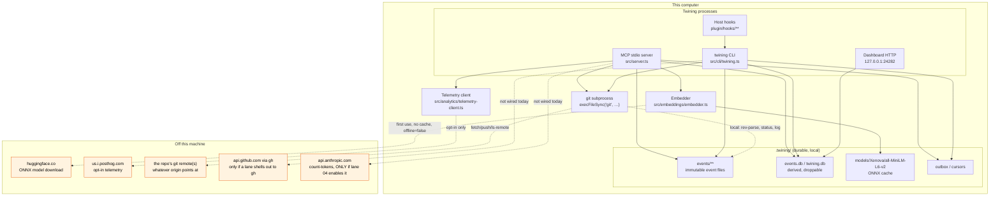

# Data flow — every path that can leave this machine

Owner: lane 05 (verification and operations). Written 2026-09-15 against
`foundation/v3` @ `5de4e00` plus the lane-05 worktree. Requirements: R09, R18, R20.
Acceptance: C28 A24 ("every outbound destination and first-use model download,
confirmed by **observed traffic**, not configuration values").

> **Status of the evidence.** Everything below was established by reading the
> source and the installed packages. The observed-traffic half is
> `scripts/measure/observe-traffic.sh`, which records what a synthetic session
> actually resolves and connects to. Read §5 for exactly what that script can
> and cannot prove before quoting it.

## 1. Components

## 2. Every outbound path

| # | Path | Destination | When it fires | Default | Switch | Evidence |
| --- | --- | --- | --- | --- | --- | --- |
| 1 | **Embedding model download** | `https://huggingface.co/` (transformers.js `env.remoteHost`), model `Xenova/all-MiniLM-L6-v2` | **First use** of semantic search when `.twining/models/Xenova/all-MiniLM-L6-v2` is absent | **ON** for the MCP server path | `offline: true` on the context — **no env var, no config key** (see F-OFFLINE) | `src/embeddings/embedder.ts:9,23,162,172-178`; `@huggingface/transformers` is an **optionalDependency** (`package.json:72-75`) and is installed in this tree |
| 2 | **Telemetry** | `https://us.i.posthog.com` (overridable via `config.telemetry.posthog_host`) | Per-event, after explicit opt-in | **OFF** — `config.telemetry.enabled` must be true | `DO_NOT_TRACK=1`, `CI=true`, or simply not opting in | `src/analytics/telemetry-client.ts:17,36-46`; identity is `sha256(hostname + projectRoot)`, never the raw values (`:49-51`) |
| 3 | **Git remote traffic** | Whatever the user's `origin`/remotes point at | Only when a Twining code path runs a network git verb | **Read-only, local verbs today** — every `execFileSync("git", …)` in `src/` that this audit found uses `rev-parse`, `status`, `log`, `branch`-style local commands; **no `push`, `fetch`, `pull`, `clone` or `ls-remote` in `src/`** | n/a | grep over `src/**` for `execFileSync("git"` → `src/storage/sync/sync-manager.ts:130`, `src/utils/provenance.ts`, `src/engine/staleness.ts`, `src/dashboard/repo-info.ts`, `src/core/commands/{record,decisions}.ts`, `src/engine/verify.ts`, `src/cli/validate-records.ts`, `src/utils/git-branches.ts` |
| 4 | **GitHub via `gh`** | `api.github.com` | Not invoked by `src/**` today | **Not wired** | n/a | no `gh` subprocess found in `src/` |
| 5 | **Anthropic count-tokens** | `api.anthropic.com` | **Not wired today.** `@anthropic-ai/sdk` appears only in `test/eval/judge.ts` (a dev-dependency eval harness), never in `src/` | **Not wired** | n/a — lane 04's brief says the exact token count is *optional* and the budget must be a "calibrated conservative bound" from a declared tokenizer | `package.json` devDependencies; `test/eval/judge.ts:14` |
| 6 | **Dashboard** | `127.0.0.1:24282` — **loopback only** | Dashboard enabled | config | local bind, not an outbound path | `src/dashboard/**` |
| 7 | **v3 exchange transports** | none yet | — | — | `src/exchange/fs-transport.ts` is a shared **directory**; `src/exchange/relay.ts` is **in-process**. `src/exchange/git-transport.ts` (ADR §8.2) is **not merged**, so the v3 exchange has no network path at all today | `ls src/exchange/` |

## 3. Findings

**F-OFFLINE (severity: medium — owner: lane 03/lane 04, whoever owns context construction).**
The embedder's `offline` flag has exactly one caller that sets it: the CLI hook
path (`src/cli/twining.ts:420`). `src/server.ts:48` calls
`createTwiningContext(projectRoot)` with no options, so the **MCP server path
defaults to `offline: false`** and will attempt a first-use download from
`huggingface.co`. There is no `TWINING_OFFLINE` environment variable and no
config key — the only env vars `src/**` reads are `CI`, `DO_NOT_TRACK`,
`POSTHOG_API_KEY`, `TWINING_AUTO_MIGRATE`, `TWINING_DISABLED`, `VITEST`. An
operator on an air-gapped or policy-restricted machine cannot turn the download
off without editing code. R18 asks for a *tested configuration* for a local
deployment; there is no configuration surface to test. Suggested fix: read
`TWINING_OFFLINE` (and a `config.embeddings.offline` key) in
`createTwiningContext`, defaulting `offline` to true when the model cache is
absent and the process has no interactive consent.

**F-TELEMETRY-KEY (severity: low — informational).**
A PostHog project key is **baked into the build** at publish time
(`scripts/inject-posthog-key.mjs` → `src/analytics/_generated-posthog-key.ts`).
It is inert while `config.telemetry.enabled` is false, and the client hashes
hostname + project root rather than sending them, but the key's presence means
"no telemetry" rests on a runtime flag rather than on the absence of a
credential. Worth stating plainly in the operator docs rather than discovering
it in a build artifact.

**F-NO-NETWORK-EXCHANGE (severity: informational).**
The v3 exchange has **no network transport at all** at this commit. Every C28
and C13/C14 result obtained today crosses a shared directory or an in-process
relay. This is not a defect — it is the state of the merge — but it means no
run to date has exercised credentials, TLS, remote authentication, rotation or
revocation on the exchange path, and none may be reported as tested.

## 4. Storage, embeddings, extraction, graph, reranking, summarization

| Stage | Where it runs | Off-machine? |
| --- | --- | --- |
| Storage (events, journal, projections) | local filesystem + `node:sqlite` (no native deps) | no |
| Embeddings | `@huggingface/transformers` ONNX runtime, in-process, CPU | **model bytes only, once** (path 1) |
| Extraction / graph construction | in-process TypeScript over local records | no |
| Reranking | not implemented as a separate service | no |
| Summarization | none in `src/**` — summaries are authored by the calling model, not generated by Twining | no |
| Telemetry | in-process, batched | **opt-in only** (path 2) |

## 5. Observing the traffic — and what that proves

`scripts/measure/observe-traffic.sh` runs a synthetic session and records what
it resolves and connects to.

**What it can prove.** That, for the exercised code path, on this machine, with
this configuration, the process made (or did not make) DNS lookups and TCP
connections to hosts outside the loopback interface, and which hosts those
were. Run with `--block`, it additionally shows the behaviour when the named
hosts are unreachable — including whether a blocked download degrades to
keyword search or hangs.

**What it cannot prove.**

1. **Absence in general.** A path not taken in this session is not a path that
   does not exist. First-use model download is, by definition, invisible on a
   machine whose cache is already warm — the script deletes the model cache in
   its own temp store to force the question, but only for the code path it
   drives.
2. **That blocking is enforcement.** `--block` uses `/etc/hosts`-style
   redirection inside a temporary `dnsmasq`-free shim, or falls back to
   observing only. macOS has no unprivileged per-process network namespace, so
   a determined process could bypass a hosts-file block by dialling an IP
   directly. Treat `--block` as a **behavioural probe**, not a sandbox.
3. **Content.** The script records destinations, not payloads. It cannot show
   that a request carried no credential or no memory content. That needs a TLS
   intercept proxy with a trusted local CA, which is deliberately out of scope
   here (it changes the thing being measured).
4. **Subprocesses that outlive the session.** Anything spawned detached, or any
   traffic a host adapter makes on Twining's behalf, is outside the observed
   process tree.

Report the script's output as *observed destinations for the exercised path*,
never as "Twining makes no network calls".
